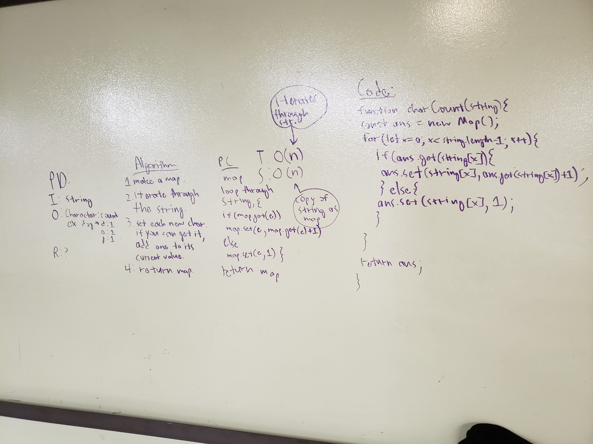

# Code Challenge 32(?) - Count The Characters

## Overview
Given a string, return a data structure that has both the corresponding letter and the amount of times that letter is used.

## Solution
Use a Map, storing values while iterating through the string. Check if it already exists before storing it. If it does, change the value of it by one.
Return the map.

## Running
`git clone` down to your machine, and then `npm i` `&&` `npm run test` while in the directory of the folder to run the tests themselves.

To use the function, either import it or require it. 

## Made In Part By
- Jest
- ES6
- Node
- Users Like You!

## Authors
[Diego Ramos](https://github.com/diego-ramos130)
